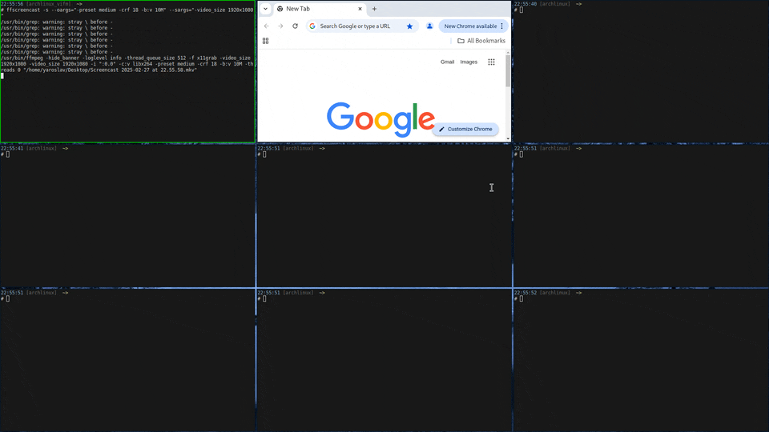
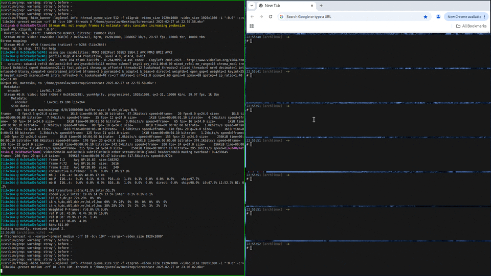
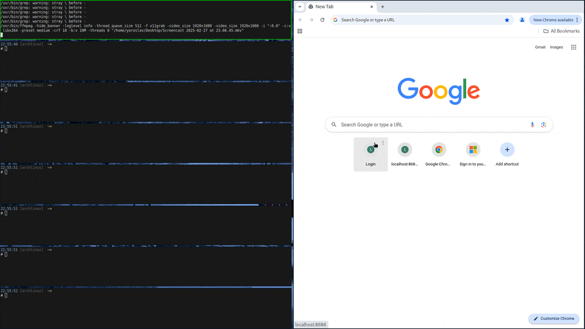
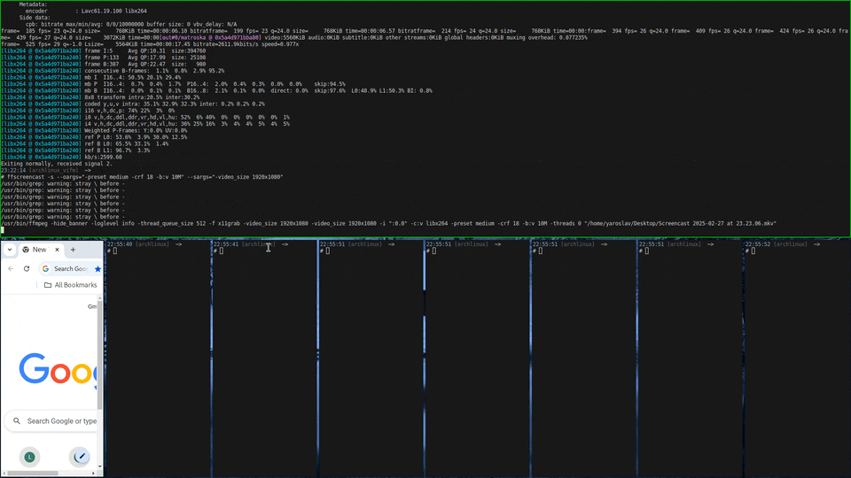
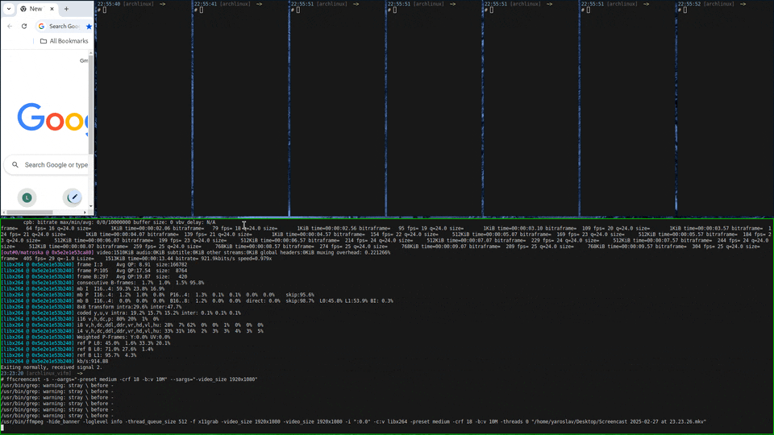
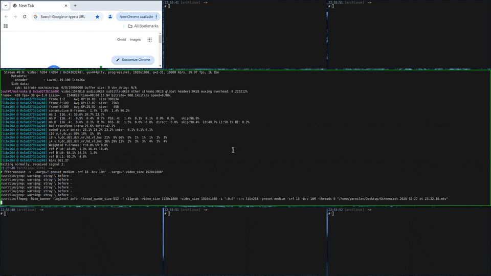
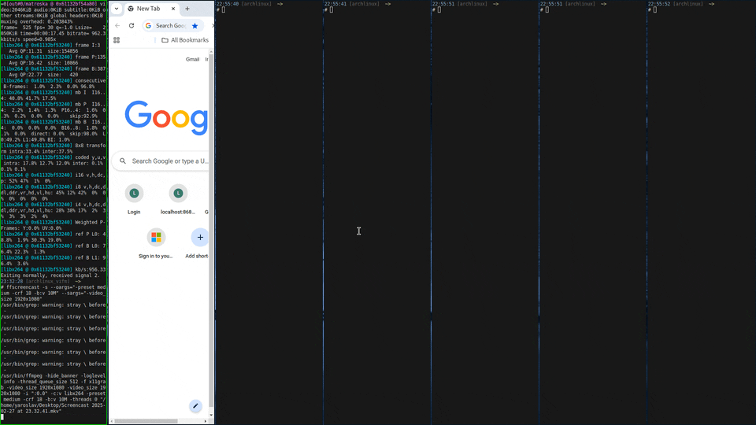
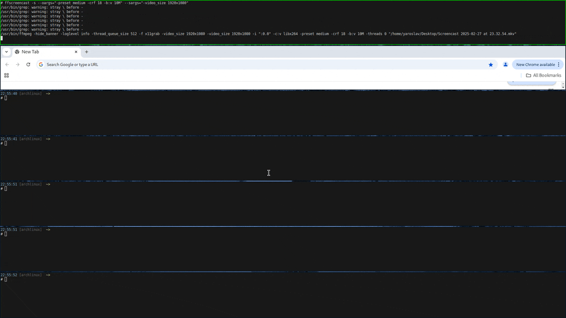

# YMWM - Yaroslav Mamykin Window Manager

The YMWM is a minimalistic tiling window manager, created for effective window management on unix-like desktop systems (debian,ubuntu,archlinux specifically) and personal joy of its creator.
YMWM solves the problem of abstraction of window management from concrete platforms like X11 and Wayland, so it would be easier to transfer from one platform to another if needed, comparing to other tiling window managers like, dwm, i3, hyperland, etc.
Besides that, YMWM is implemented in the way that it is easy to implement new features and separate functionality for focus and layout management.

Currently YMWM supports only X11 implementation, based on Xlib. The Wayland is planned to be done in future.

## Table of Contents

- [Key features](#key-features)
- [Dependencies](#dependencies)
  - [Archlinux packages](#archlinux-packages)
  - [Ubuntu packages](#ubuntu-packages)
- [How to build](#how-to-build)
  - [Release](#release)
  - [Debug (for development only)](#debug-for-development-only)
- [How to run tests (for development only)](#how-to-run-tests-for-development-only)
- [How to run YMWM](#how-to-run-ymwm)
- [Concepts](#concepts)
- [Layouts](#layouts)

## Key features

The YMWM supports next functionality:

- Layout-based management of windows
- Keyboard-friendly navigation between windows
- Dynamic management of `main` window size in different layouts, like `Centered`, `Stack*`.
- Grouping windows. Only one group can be active per time. Switching between groups is done by keyboard as well.
- Moving windows between groups.
- Auto-removing group, if last window was removed.
- Built-in support for background image (usually people use external managers like `feh` for this purpose).
- Built-in support for screenshot. Screenshots are saved into user-configured folder and in memory, so you can quickly paste it into your messanger (e.g. Telegram).
- Built-in support for setting keyboard layouts (usually done by `setxkbmap`).
- Default config generation without need of X11 or Wayland running. Very useful for starting with your own config!

## Dependencies

### Archlinux packages

- cmake
- git
- make
- clang
- gcc
- libx11
- xorg-setxkbmap
- imlib2
- libheif
- libid3tag
- openjpeg2
- libjxl
- libspectre
- librsvg
- libwebp
- cairo

### Ubuntu packages

- cmake
- git
- make
- clang
- gcc
- libx11-dev
- x11-xkb-utils
- libimlib2-dev
- libheif1
- libid3tag0
- libopenjp2-7
- libjxl0.7
- libspectre1
- librsvg2-2
- libwebp7
- libcairo2

## How to build

### Release

1. `cmake -S . -B RELEASE -DCMAKE_BUILD_TYPE=RELEASE -DCMAKE_INSTALL_PREFIX=<wherever-you-prefer>`
2. `cmake --build RELEASE --parallel`
3. `cmake --install RELEASE --strip`
4. Step 3 might require `sudo` priviledges. If so, execute `sudo !!`.

### Debug (for development only)

1. `cmake -S . -B DEBUG -DCMAKE_BUILD_TYPE=DEBUG -DBUILD_TESTS=TRUE -DCMAKE_INSTALL_PREFIX=DEBUG`
2. `cmake --build DEBUG --parallel`
3. `cmake --install DEBUG`

## How to run tests (for development only)

1. Build DEBUG (see above).
2. ctest --test-dir DEBUG/tests --verbose

## How to run YMWM

1. Generate default config file with `$(which YMWM) -gdco default.yaml`.
2. Modify default config whatever way you prefer, just preserve data accuracy and types.
3. Run for e.g. X11: `startx $(which YMWM) --config <path-to-config>`.

## Concepts

There are certain number of abstractions present in YMWM, that help in representing business logic.

- Environment - represents wrapper over environment(X11, Wayland) which handles event loop, background image and keyboard layout.
- Event - represents event, that comes from Environment. E.g. Key pressed, Mouse moved, etc.
- Command - represents action, that can be bound to certain event. For now, only one command can be bound to Event.
- Layout - represent layout to be applied on Windows.
- Parameters - concrete parameters for specific layout.
- Window - represents window instance itself. Holds window ID, assigned by environment, window coords, width, height and name.
- Manager - represents window management entity, that covers windows adding, removing, moving and resizing according to layout and focusing the right one. Manager itself represents a single group of windows.
  - LayoutManager - part of Manager, handles layout application and update for windows in group.
  - FocusManager - part of Manager, handles focus management on windows of single group.
- GroupManager - represents group management, handles groups adding and removal.

## Layouts

### Centered

Places windows one behind the other, correlating their centers with center of the screen. Windows are resizable by width. The minimum width is 20% of screen width and maximum is 100%.
This layout is useful for wide screens, when window must be limited in size and placed in center of screen.

### Grid

Places windows in symmetrical grid, meaning grids like 2x2, 3x3 and so on, depending on current number of windows in Group.
Useful to monitor multiple windows at once.

### Stack layouts

Stack layouts are useful when user wants one of the windows to be `main`(i.e. occupying half or more screen space) and other windows to be `stack`ed aside.
This helps in writing code and monitoring several windows with logs in the same time.

### StackVerticalRight

Places `main` window to the left and `stack` windows to the right side of the screen. `Main` and `stack` windows are resizable.

### StackVerticalLeft

Places `main` window to the right and `stack` windows to the left side of the screen. `Main` and `stack` windows are resizable.

### StackVerticalDouble

Places `main` window to the center of the screen and `stack` windows on both sides of it(left and right). `Main` and `stack` windows are resizable.

### StackHorizontalTop

Places `main` window to the top and `stack` windows to the bottom of the screen. `Main` and `stack` windows are resizable.

### StackHorizontalBottom

Places `main` window to the bottom and `stack` windows to the top of the screen. `Main` and `stack` windows are resizable.

### StackHorizontalDouble

Places `main` window to the center of the screen and `stack` windows on both sides of it(top and bottom). `Main` and `stack` windows are resizable.

### ParallelVertical

Places windows vertically in parallel to each other equally sized.

### ParallelHorizontal

Places windows horizontally in parallel to each other equally sized.

